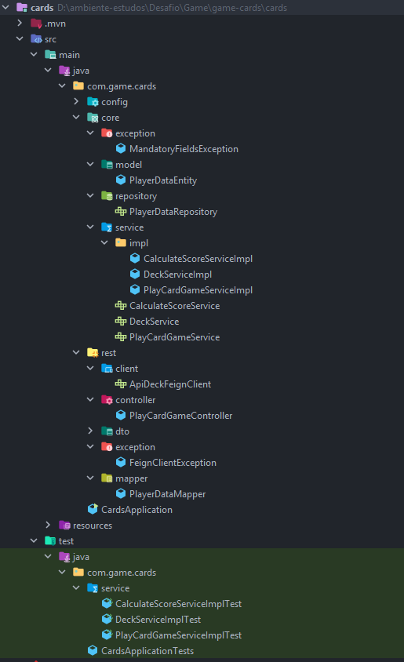

# Jogo de Cartas - Play Card Game

## Descrição do Projeto

Este projeto é uma API que permite realizar jogos de cartas de forma dinâmica. É possível definir a quantidade de jogadores e o número de cartas que cada jogador irá receber. O sistema calcula a pontuação com base nos valores das cartas e retorna o vencedor. Caso haja um empate, o sistema retorna todos os jogadores empatados.

### Exemplo de Resultado:

```json
[
    {
        "id": 13,
        "numberPlayer": 1,
        "score": 41,
        "createdAt": "2025-01-26T10:33:52.4653597"
    },
    {
        "id": 14,
        "numberPlayer": 2,
        "score": 41,
        "createdAt": "2025-01-26T10:33:52.4653597"
    }
]
```

---

## Funcionalidades

- **Definir jogo:** Configura dinamicamente o número de jogadores e cartas.
- **Cálculo de pontuação:** Calcula automaticamente a pontuação com base nos valores das cartas.
- **Identificação de vencedores:** Retorna o jogador com a maior pontuação ou uma lista de jogadores em caso de empate.
- **Persistência de dados:** Salva os dados dos vencedores em um banco de dados.

---

## Tecnologias Utilizadas

- **Java 17**
- **Spring Boot** (framework principal)
- **Feign Client** (para integração com APIs externas)
- **Postgres** (banco de dados para persistência dos jogadores vencedores)
- **Swagger** (documentação da API)
- **Docker** (Conteinerização da aplicação e banco de dados)
- **Testes Unitários** (JUnit e Mockito)
- **Arquitetura Modular** (O projeto foi estruturado de forma modular, com cada camada focada em uma responsabilidade específica. Isso ajuda a deixar o código mais organizado, fácil de manter.)

---

## Estrutura do Projeto



### Camada REST (`com.game.cards.rest`)

- **Controller**:
  - `PlayCardGameController`: Gerencia as chamadas REST para iniciar o jogo.
- **DTOs**:
  - `DeckResponseDTO`: Representa os dados do baralho criado.
  - `DrawResponseDTO`: Representa as cartas sorteadas.
  - `CardDTO`: Representa os detalhes de uma carta.
  - `PlayerDataResponseDTO`: Representa os dados do jogador retornados na API.
- **Client**:
  - `ApiDeckFeignClient`: Realiza a integração com a API externa para gerenciar o baralho.
- **Exception**:
  - Define exceções relacionadas à interface REST.

### Camada Core (`com.game.cards.core`)

- **Services**:
  - `PlayCardGameServiceImpl`: Gerencia a lógica principal do jogo de cartas.
  - `DeckServiceImpl`: Gerencia a criação e seleção de cartas do baralho.
  - `CalculateScoreServiceImpl`: Realiza o cálculo da pontuação das cartas.
- **Repository**:
  - `PlayerDataRepository`: Persistência dos dados dos jogadores.
- **Model**:
  - `PlayerDataEntity`: Representa as entidades dos jogadores no banco de dados.
- **Exception**:
  - Define exceções relacionadas à lógica de negócio.

---

## Como Executar

### Executando com Docker Compose

1. **Clone o repositório:**

   ```bash
   git clone <https://github.com/andredejesus/game-cards.git>
   ```

2. **Execute o Docker Compose:**

   ```bash
   docker-compose up --build
   ```

   Este comando irá construir a imagem da aplicação e iniciar os serviços definidos no `docker-compose.yml`, incluindo o banco de dados PostgreSQL.

3. **Acesse a API:**

   - Swagger UI: [http://localhost:8080/swagger-ui.html](http://localhost:8080/swagger-ui.html)
   - Endpoint principal: `GET /play`

   Parâmetros de entrada:

   - `qtdPlayers` (Integer): Quantidade de jogadores.
   - `countCards` (Integer): Quantidade de cartas por jogador.

   Exemplo de requisição:

   ```bash
   curl "http://localhost:8080/play?qtdPlayers=3&countCards=5"
   ```

---

## Estrutura do Endpoint Principal

### `GET /play`

- **Descrição:** Inicia um novo jogo com a quantidade de jogadores e cartas especificados.
- **Parâmetros:**
  - `qtdPlayers` (obrigatório): Quantidade de jogadores.
  - `countCards` (obrigatório): Quantidade de cartas por jogador.
- **Códigos de Resposta:**
  - `200`: Sucesso.
  - `400`: Campos obrigatórios não informados.
  - `500`: Erro interno no servidor.
- **Exemplo de Resposta:**

```json
[
    {
        "id": 1,
        "numberPlayer": 1,
        "score": 41,
        "createdAt": "2025-01-26T10:33:52.4653597"
    }
]
